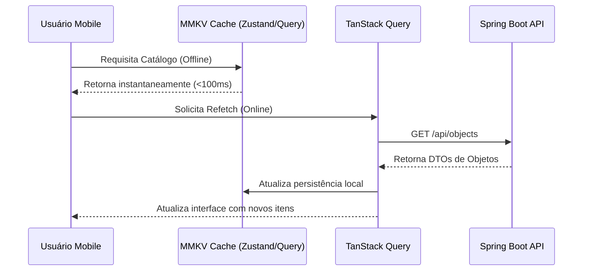

# Implementation Plan: TrecoDex Mobile Foundation

**Branch**: `001-mobile-app-foundation` | **Date**: 2026-05-20 | **Spec**: [spec.md](./spec.md)
**Input**: Feature specification from `/specs/001-mobile-app-foundation/spec.md`

---

## Summary

O objetivo deste plano é estabelecer a arquitetura técnica e o design de software para a fundação do aplicativo móvel **TrecoDex Mobile**, focado exclusivamente na robustez dos fluxos funcionais e resiliência de sincronização. Toda a estilização avançada, animações complexas e shaders de câmera estão **fora de escopo** para este MVP e postergados para outra etapa técnica. O layout do aplicativo será mantido extremamente simples (padrão de wireframe limpo).

Nossa abordagem aproveita ao máximo a stack técnica homologada, já inicializando as bibliotecas como esqueletos funcionais estruturados para posterior estilização estética:

- **Expo Router** para roteamento e fluxo de telas em formato de abas e modais funcionais básicos.
- **Zustand** para gerenciamento de estado de fluxos e controle conversacional do onboarding.
- **TanStack Query (React Query)** para chamadas e cache resiliente com o Spring Boot backend (`treco-dex-api`).
- **MMKV** para persistência local síncrona ultra-rápida.
- **Reanimated, Moti e React Native Skia** instalados e instanciados em formato de containers esqueléticos (sem shaders ou físicas complexas) apenas para garantir o acoplamento completo de dependências nativas.

---

## Technical Context

**Language/Version**: TypeScript >= 5.0 (Strict mode ativo)  
**Primary Dependencies**:

- `expo` (SDK 50+)
- `expo-router` (File-based navigation)
- `zustand` (State management)
- `@tanstack/react-query` (API Sync & Cache)
- `react-native-mmkv` (Fast local store)
- `react-native-reanimated` & `moti` (Animations)
- `@shopify/react-native-skia` (2D high-performance drawings & shaders)
  **Storage**: MMKV (Key-Value) e opcionais SQLite local  
  **Testing**: Jest + React Native Testing Library  
  **Target Platform**: iOS 15+ & Android 8+ (SDK 26+)  
  **Project Type**: Mobile Application  
  **Performance Goals**: Animações a 60/120 FPS fixos; tempo de resposta de buscas locais <100ms; tempo de cold start <1.2s.  
  **Constraints**: Funcionamento 100% offline para busca local e navegação; fila offline para uploads resilientes.

---

## Constitution Check

_GATE: Passed. O plano cumpre todas as diretrizes de UI Premium, Offline-First, IA-Native e Contratos Tipados estabelecidas na Constitution do Projeto._

- **Premium UI**: Skia + Reanimated + Moti garantem transições ricas de cards de objetos no padrão Pokédex cyberpunk.
- **Offline-First**: Persistência via MMKV e gerenciamento de mutações offline via React Query.

---

## Project Structure

A estrutura de arquivos do aplicativo móvel foi projetada para ser modular, isolada por contextos e 100% tipada:

```text
specs/001-mobile-app-foundation/
├── spec.md              # Requisitos funcionais e jornadas de usuário
├── plan.md              # Este arquivo (Arquitetura e Stack)
└── checklists/
    └── requirements.md  # Checklist de qualidade da especificação
```

### Source Code layout (`/home/guilherme.padilha/projetos/treco-dex-mobile`)

```text
src/
├── app/                  # Roteamento baseado em arquivos (Expo Router)
│   ├── (auth)/           # Telas de Login e Registro seguro
│   │   ├── login.tsx
│   │   └── register.tsx
│   ├── (tabs)/           # Abas principais (Home, Camera/Search, Profile)
│   │   ├── index.tsx     # Home (Pokedex Grid & Ambientes)
│   │   ├── camera.tsx    # Camera & Conversational Onboarding UI
│   │   └── profile.tsx   # Perfil do usuário
│   └── _layout.tsx       # Root layout contendo Providers
├── components/           # Componentes visuais reutilizáveis
│   ├── ui/               # Componentes atômicos (Card, Button, Input, Skia Canvas)
│   └── chat/             # Componentes da interface do onboarding conversacional
├── hooks/                # Custom React Hooks (useAuth, useCamera, useSync)
├── services/             # Camada de Integração e APIs
│   ├── api.ts            # Cliente Axios tipado com interceptadores JWT
│   └── queries/          # React Query Hooks (useObjects, useVisualSearch)
├── store/                # Estado Global local (Zustand)
│   ├── useAuthStore.ts   # Estado de sessão
│   └── useSyncStore.ts   # Fila de sincronização offline
└── utils/                # Utilitários (Formatadores, Compressão de Mídia)
```

**Structure Decision**: Optou-se por uma estrutura unificada `src/` modularizada por responsabilidade, em vez de pacotes divididos, visto que se trata da fundação do front nativo focado no MVP.

---

## Architectural Detail & Tech Design

### 1. Offline-First Sync Architecture (TanStack Query + MMKV)

- O estado de dados de trecos e habitats é gerenciado na rede pelo **TanStack Query**.
- Para garantir o carregamento offline instantâneo, persistiremos as queries em cache no **MMKV** utilizando o custom persister do TanStack Query (`createSyncStoragePersister`).
- **Offline Mutations**: Modificações feitas offline (como alterar estado de um treco) são salvas em uma fila (`useSyncStore` do Zustand com persistência automática no MMKV). Ao detectar reconexão com a rede (`NetInfo`), um worker dispara as requisições em lote para o backend.



### 2. Conversational Onboarding & Vision UI (Zustand + Camera)

- A tela de Câmera nativa abre a câmera padrão do dispositivo com uma sobreposição Skia extremamente simples (uma mira de wireframe básica centralizada).
- Ao tirar a foto, salvamos o buffer local, comprimimos a imagem usando biblioteca nativa e enviamos à API (`/api/objects/visual-search` ou `/api/media/upload`).
- O diálogo interativo do chat é mantido em um store Zustand leve (`useChatOnboarding`), renderizando mensagens em caixas de textos básicas com transições nativas padrão. O Moti é instanciado em modo esquelético (transição de fade-in padrão de opacidade) apenas para validação de encadeamento de biblioteca.
